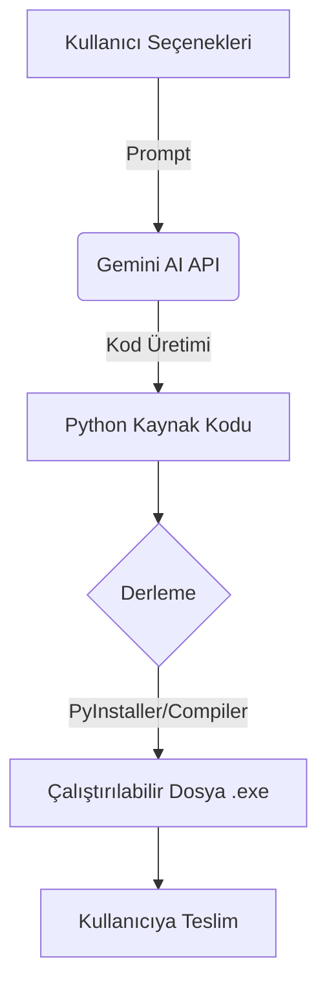

  

# 🚀 YourApp | Kendi uygulamanı oluştur.
### ⚙ Anlayabileceğiniz bir dil seçiniz : 

  
   
  

 

>[!WARNING]
> Uygulama ilk sürümlerindedir. Çeşitli özellikler sınırlandırılmış veya olmayabilir, uygulamaya gelen destek ve talebe göre güncelleme atılmaktadır. Uygulama kendi deneyimlerimiz ve deneyimlerimizi geliştirmekte olduğumuz için hatalar veya anlamsız kodlar yapılar ile karşılaşabilirsiniz.

### ⚡ Temel Özellikler
- ✅ .exe formatında uygulamayı çalıştır.
- ✅ Açık kaynak proje ile kodları okuyabilirsiniz.
- ✅ Yapay zeka ile kodları yazma.
- ✅ Basit mantık ile çalışmakta.

### 📈 Basitçe Nasıl Çalışır?

### 📄 Uygulama Hakkkında
YourApp uygulaması, uygulama oluşturma kısmından seçenekleri işaretleyerek ve istediğiniz uygulamayı biraz açıklayarak yapay zekaya gönderin ve kendi uygulamanızı oluşturun. Tabi ki oluşturulan ürünü %100 doğru ve hatasız değildir. Uygulama MIT lisansı vardır.

>[!IMPORTANT]
> Yapay zeka aracının API anahtarı size ait olması gerekir.

### ❓ Nasıl Kullanılır?
Öncelikle, ayarlardan api anahtarı kısmına kendi api anahtarınızı girin ve altındaki yapay zeka modelinide giriniz. Konsol Açık kısmında ise eğer açık ise uygulamanın yapılış ve derleniş sırasındaki debug komutlarını görebilirsiniz. Uygulama oluştur kısmında ise kendi kişisel zevkinize veya ihtiyacınıza göre seçenekleri işaretleyip kısaca uygulamayı yazıp gönderin. Uygulama en iyi promptu seçerek sizin seçeneklerinizi yapay zekaya gönderir ve yapay zekada bu uygulamayı yapar.

### ❗ Hata Kodları
- Repository Not Found : Bu hata uygulamanın açık kaynak kodunun barındığı deponun bulunamadığını gösterir. Deponun olmaması uygulamaya ait verileri indirmede sorunların çıkacağını bildirir.

 

_2026 Keops Studios | YourApp_
