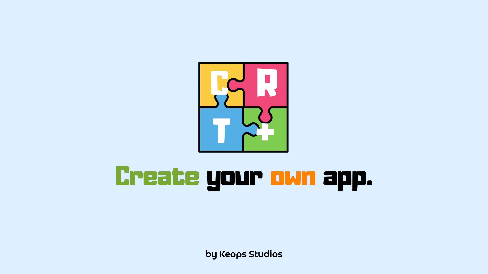
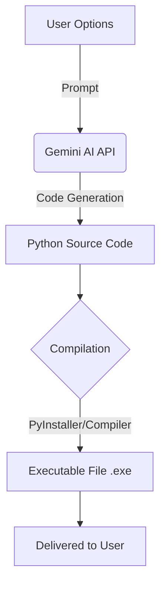

  

# 🚀 YourApp | Create your own app.

### ⚙ Please select a language you can understand:

  
   
  

>[!WARNING]
>The application is in its early stages. Various features may be limited or missing; updates are released based on the support and demand for the application. As we are developing our own experiences and experiments, you may encounter errors or nonsensical code structures.

>[!CAUTION]
> The AI ​​model must be Gemini AI; otherwise, it will be disabled. API addresses of other AIs will not be accepted and will result in an error.

>[!NOTE]
> Python 3.11 must be installed on your computer when downloading the application. Setting this method both prevents errors and facilitates the download, allowing the application to be converted to .exe format.

### ⚡ Key Features :
- ✅ Run the application in .exe format.

- ✅ Read the code with the open-source project.

- ✅ Write code using Artificial Intelligence.

- ✅ Works with simple logic.

### 📈 How It Works Simply?

 

### 📄 About the Application
With the YourApp application, create your own software by selecting options from the application creation section and briefly describing the application you want to send to the AI. Of course, the generated product is not 100% accurate and bug-free. The application is under the MIT license.

 

### ❓ How to Use?
First, enter your own API key in the API key section within settings and enter the AI model below it. In the "Console Open" section, if enabled, you can see the debug commands during the creation and compilation of the application. In the "Create Application" section, select options according to your personal taste or needs, briefly describe the application, and send it. The application selects the best prompt to send your options to the AI, and the AI builds this application.

 

### ❗ Error Codes
Repository Not Found: This error indicates that the repository where the application's open-source code is hosted could not be found. The absence of the repository indicates that there will be issues in downloading the application data.

 

## Contact Us!
Having a problem? Contact us using the links below.
- <a href="https://linktr.ee/thekeops">All Links</a>
- <a href="https://github.com/thekeops">Github</a>
- <a href="https://instagram.com/keopsstudios">Instagram</a>
- <a href="https://youtube.com/@keopsstudios">YouTube</a>
- <a href="https://x.com/keopsstudios">X (Twitter)</a>

 

_2026 Keops Studios | YourApp_
